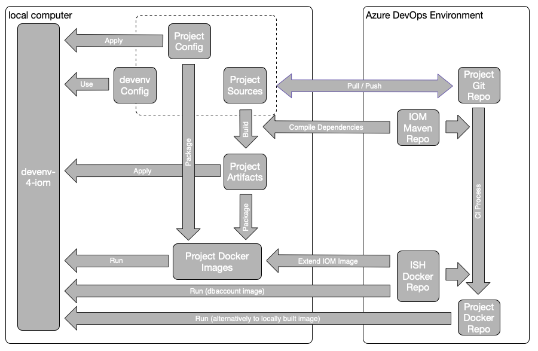

# Azure DevOps Integration

## Overview

The figure below shows the relations between *devenv-4-iom*, an IOM-project and the *Azure DevOps Environment*, which is part of the *Intershop Commerce Platform*. The *Azure DevOps Environment* is providing build-artifacts (by *IOM Maven Repo*) and the IOM Docker-images (by *ISH Docker Repo*). Both are required to develop IOM-projects.

Additionally, the *Azure DevOps Environment* provides project specific Docker images (by *Project Docker Repo*), which are used by *devenv-4-iom* to run the IOM project locally.

## Get Access to Maven Repository

When creating a new IOM-project, the project will be tied to a certain *Azure DevOps Environment* (see [Documentation of *IOM Project Archetype*](https://github.com/intershop/iom-project-archetype/blob/main/README.md)). 

The URL of the *Maven Repository*, that is providing the IOM build artifacts (//repositories/repository[id='iom-maven-artifacts']/url in *pom.xml*) is specific for each *Azure DevOps Environment*. In order to build the IOM-project locally, the local computer needs to have read-access to this Maven Repository too.

To get access to this Maven Repository, the file *~/.m2/settings.xml* has to be created or modified. This file will contain the credentials for the access to the Maven Repository. The *Azure DevOps Environment* provides all the necessary information to setup *~/.m2/settings.xml*. Just follow these steps:

1. Log in to *Azure DevOps Environment*
2. Open *Artifacts* in menu on the left
3. Select feed *iom-maven-artifacts*
4. Click *Connect to Feed*
5. Select *Maven*
6. Follow the instruction to *Add or Edit settings.xml ...*. Remember creating a *Personal Access Token* and putting it into *~/.m2/settings.xml*, too.

## Get Access to *Intershop Docker Repository*

The *Intershop Docker Repository* provides the Standard IOM Docker images. These Standard IOM Docker images have two purposes:
* The IOM Docker image will be extended by the IOM-project with project specific customizations and configurations. Hence, when building the IOM project locally, read access to the *Intershop Docker Repository* is required.
* The IOM dbaccount image is required to run the IOM project locally within *devenv-4-iom*. This image serves as an initialization image, that is preparing the database account.

Hence, read access to *Intershop Docker Repository* is required for building the IOM project *and* for running it in *devenv-4-iom*. Both types of usage are requiring different methods to provide this access.

In both cases the *CLI secret* is required. To get the *CLI secret*, please follow these steps:

1. Open [docker.tools.intershop.com](https://docker.tools.intershop.com) in the browser.
2. Log in with *LOGIN VIA OIDC PROVIDER* and use your Intershop Azure account.
3. Select *User Profile* on top left of the page.
4. In the dialog you can copy the CLI secret.

In order to build the IOM project locally, you have to always log in to *docker.tools.intershop.com* using your Intershop Azure account and the CLI secret:

    docker login docker.tools.intershop.com

For running the IOM project in *devenv-4-iom*, an *image pull secret* (Kubernetes secret object) has to be created for *docker.tools.intershop.com*. The *image pull secret* has to be created within the default namespace of Kubernetes and the name of the secret has to be set within the configuration of *devenv-4-iom*.

The following command shows how to create the Kubernetes secret *intershop-pull-secret*:

    kubectl create secret docker-registry intershop-pull-secret \
      --context="docker-desktop" \
      --docker-server=docker.tools.intershop.com \
      --docker-username='<your Intershop Azure account>' \
      --docker-password='<CLI secret>'

Finally, the name of the newly created Kubernetes secret has to be passed to *devenv-4-iom*. To do so, set the key *IMAGE_PULL_SECRET* within the user-specific configuration file of *devenv-4-iom* (devenv.user.properties):

    # change into the root directory of IOM project
    echo IMAGE_PULL_SECRET=intershop-pull-secret >> devenv.user.properties

## Get Access to *Project Docker Repository*

The *Project Docker Repository* contains all project-specific Docker images, which have passed the CI process of the *Azure DevOps Environment*. The Docker images of this repository should be used by *devenv-4-iom* to run local customizations/configurations on top of them.

Since the *Project Docker Repository* is a private Docker registry too, a second *image pull secret* has to be created. If there exists an according
*service principal*, the ID of the service principal can be used for *--docker-username* and the value of the *service principal* can be used for *--docker-password*, when creating the secret.

If there is no *service principal* at all, Azure Container Registries provide a simple admin-user access. The accoring credentials can be found in *Azure*:
1. Navigate to *Home*
2. Open resource of ACR matching the naming pattern: \<partner organization name without dash\>acr.azurecr.io
3. Open *Access keys*. Use these credentials for the creation of the new *image pull secret*.

Now create the new Kubernetes secret *project-pull-secret*:

    kubectl create secret docker-registry project-pull-secret \
      --context="docker-desktop" \
      --docker-server='<partner organization name without dash>acr.azurecr.io' \
      --docker-username='<ID of service principal or username from Access keys>' \
      --docker-password='<value of service principal of password from Access keys>'

The new Kubernetes secret has also to be added to property *IMAGE_PULL_SECRET* within the user-specific configuration file of *devenv-4-iom* (devenv.user.properties):

    # change into the root directory of IOM project
    # append ',project-pull-secret' to the line beginning with IMAGE_PULL_SECRET=
    # the whole line should look like:
    # IMAGE_PULL_SECRET=intershop-pull-secret,project-pull-secret
    vi devenv.user.properties

---
[< Configuration](02_configuration.md) | [^ Index](../README.md) | [Development Process >](04_operations.md)
